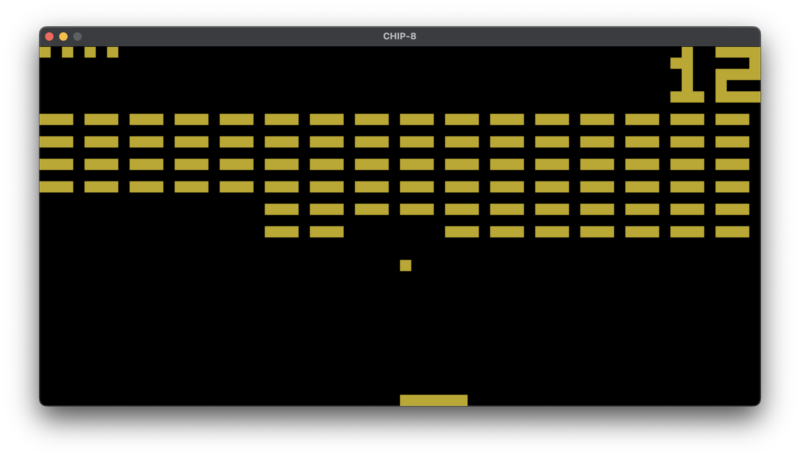

# CHIP-8 Emulator

Written in Go and SDL.



> CHIP-8 is an interpretted programming language developed by Joseph Weisbecker in the mid 70s
> and was initally used on the COSMAC VIP and Telmac 1800 8-bit microcomputers to make game programming easier.
> CHIP-8 programs are run using a CHIP-8 virtual machine.

## Limitations

This emulator doesn't support audio so far.

## Compiling and Running

Requires make and Golang:

```shell
$ make run rom=<rom-file-name>
```

24 (public domain) ROMs are included in the roms directory, see:

- [github.com/JamesGriffin/CHIP-8-Emulator](https://github.com/JamesGriffin/CHIP-8-Emulator)
- [github.com/corax89/chip8-test-rom](https://github.com/corax89/chip8-test-rom)

## Keyboard map

Here's how your PC/Mac keyboard maps to CHIP-8's keypad:

```text

     PC/Mac                  CHIP-8
╔═══╤═══╤═══╤═══╗       ╔═══╤═══╤═══╤═══╗
║ 1 │ 2 │ 3 │ 4 ║       ║ 1 │ 2 │ 3 │ C ║
╟───┼───┼───┼───╢       ╟───┼───┼───┼───╢
║ q │ w │ e │ r ║       ║ 4 │ 5 │ 6 │ D ║
╟───┼───┼───┼───╢       ╟───┼───┼───┼───╢
║ a │ s │ d │ e ║       ║ 7 │ 8 │ 9 │ E ║
╟───┼───┼───┼───╢       ╟───┼───┼───┼───╢
║ z │ x │ c │ v ║       ║ A │ 0 │ B │ F ║
╚═══╧═══╧═══╧═══╝       ╚═══╧═══╧═══╧═══╝
```

Also, `<Backspace>` key acts as `<Reset>` button - it restarts the emulator immediately.

## References

Some helpful resources I've used when writing this:

- [tobiasvl.github.io/blog/write-a-chip-8-emulator](https://tobiasvl.github.io/blog/write-a-chip-8-emulator/)
- [multigesture.net/articles/how-to-write-an-emulator-chip-8-interpreter](http://www.multigesture.net/articles/how-to-write-an-emulator-chip-8-interpreter/)
- [github.com/JamesGriffin/CHIP-8-Emulator](https://github.com/JamesGriffin/CHIP-8-Emulator)
- [wikipedia.org/wiki/CHIP-8](https://en.wikipedia.org/wiki/CHIP-8)

## License

The source code of this project is licensed under [the MIT license](LICENSE).
